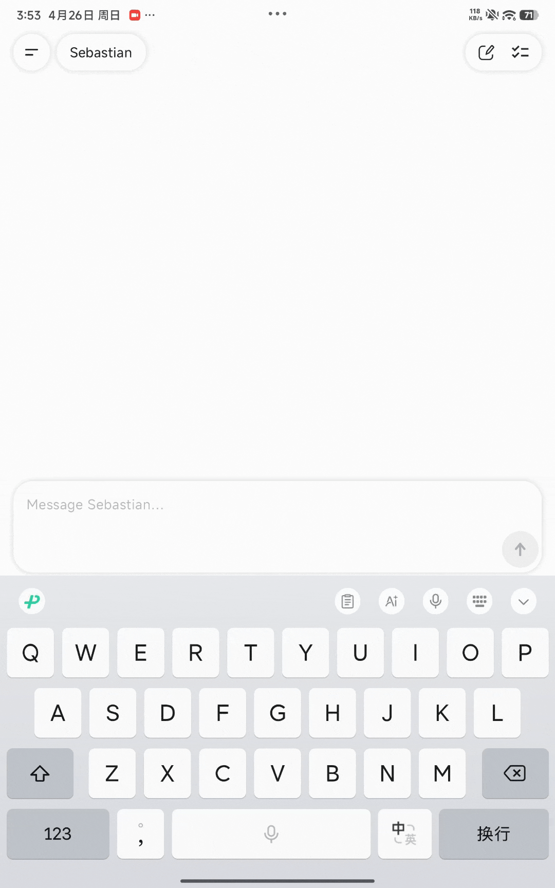
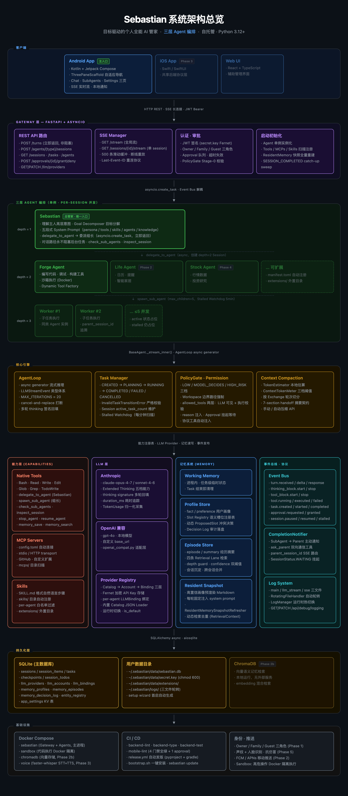

<div align="center">

<!-- TODO: Replace with project logo when ready -->
<!-- <picture>
  <source media="(prefers-color-scheme: dark)" srcset="docs/assets/logo-dark.svg">
  
</picture> -->

# Sebastian

**Your self-hosted AI butler — inspired by the indefatigable Sebastian Michaelis.**

[](LICENSE)
[](https://www.python.org/downloads/)
[](https://github.com/PhantomButler/Sebastian/actions/workflows/ci.yml)

[简体中文](README.zh-CN.md)

</div>

---

Sebastian is a goal-driven personal AI butler system. Tell it what you want — it figures out the *how*, decomposes goals, delegates to specialized sub-agents, and keeps working even after you close the app. Self-hosted, private by default, with an Android app as the primary interface.

> [!NOTE]
> Sebastian is designed for **personal and family use** — it's not an enterprise product. Self-hosted on your own machine, your data never leaves your control.

---

## Demo

<table>
  <tr>
    <td align="center" width="50%">
      
      <br><sub><b>Forge Agent — autonomous coding & debugging</b></sub>
    </td>
    <td align="center" width="50%">
      
      <br><sub><b>Memory system — remembers you across sessions</b></sub>
    </td>
  </tr>
</table>

---

## ✨ Key Features

- 🏠 **Self-hosted & private** — Runs on your machine. No cloud dependency, no data leaks.
- 🤖 **Three-tier agent architecture** — Sebastian (head butler) delegates to team leads, who dispatch workers. Your goals get executed, not just answered.
- 📱 **Native Android app** — Real-time streaming responses, thinking blocks, tool call cards. Built with Kotlin + Jetpack Compose.
- 🔧 **Zero-config extensibility** — Add tools, MCP servers, skills, and sub-agents by creating files. No core code changes needed.
- 🧠 **Persistent memory** — Remembers your preferences and past interactions. Profile facts, episodic history, and a resident snapshot injected into every conversation.
- 🔒 **Permission & approval system** — Sensitive operations require your approval. Three-tier risk classification (Low / Model-Decides / High-Risk).
- 🚀 **Dynamic Tool Factory** — When an agent needs a tool that doesn't exist, it can write one, test it in a sandbox, and register it — all autonomously.

## What's Built

- ✅ Real-time chat with streaming responses & thinking block display
- ✅ Three-tier agent orchestration — delegation, dispatch, stalled detection
- ✅ Sub-agent management & session monitoring
- ✅ Approval notifications for sensitive operations
- ✅ LLM provider configuration (Anthropic, OpenAI, custom base URL)
- ✅ Persistent memory — profile facts, episodic history, resident snapshot
- ✅ Tool call visualization & execution feedback
- ✅ Session & task history with timeline hydration
- ✅ One-click install, update & auto-rollback
- ✅ Headless server initialization

## ⚡ Quick Start

### Install Server (macOS / Linux)

```bash
curl -fsSL https://raw.githubusercontent.com/PhantomButler/Sebastian/main/bootstrap.sh | bash
```

This installs the Sebastian backend service on your machine — downloads the latest release, verifies SHA256 checksums, installs dependencies, and launches the setup wizard. Open the URL it prints, set your name and password, and you're done.

### Install Android App

Download `sebastian-app-v*.apk` from [Releases](https://github.com/PhantomButler/Sebastian/releases) and install it on your phone.

On first launch, go to **Settings → Connection** and enter your server URL: `http://<your-local-ip>:8823`

### Connect Your AI Provider

After setup, open the Android app and go to **Settings → Providers**. Add your LLM provider (Anthropic, OpenAI, etc.) — API keys are stored encrypted on your machine, never sent to any cloud service.

## 🧭 Common Commands

```bash
sebastian serve              # Start the server (first launch opens setup wizard)
sebastian serve --host 0.0.0.0 --port 8823   # Custom bind address
sebastian init --headless    # Initialize without browser (for headless servers)
sebastian update             # Update to latest release (auto-rollback on failure)
sebastian update --check     # Check for updates without installing
```

## 🖥️ Running as a System Service

After installation, you can register Sebastian to start automatically:

```bash
sebastian service install   # Register and start the service
sebastian service status    # Check service status
sebastian service stop      # Stop the service
sebastian service uninstall # Uninstall the service
```

- **macOS**: `~/Library/LaunchAgents/com.sebastian.plist`
- **Linux**: `~/.config/systemd/user/sebastian.service` (user-level, no sudo required)

Linux users who want auto-start on login need to enable linger:

```bash
sudo loginctl enable-linger $USER
```

### Data Directory Layout

```
~/.sebastian/
  app/         # Installation tree (sebastian update only touches this)
  data/        # User data: sebastian.db / secret.key / workspace / extensions
  logs/        # Log files
  run/         # PID file + update rollback backups
  .layout-v2   # Migration marker
```

Upgrading from an older version? `sebastian serve` automatically migrates the flat layout to this structure on first run.

## 🏗️ Architecture

<div align="center">
  <a href="docs/architecture/diagrams/system-overview.html">
    
  </a>
  <p><sub><a href="docs/architecture/diagrams/system-overview.html">↗ Open interactive diagram</a></sub></p>
</div>

Every agent inherits from `BaseAgent` — same tool system, same streaming loop, same memory access. Sebastian adds goal decomposition and delegation on top; team leads add domain-specific tools and worker dispatch.

### The Manor System

Inspired by a traditional butler hierarchy: you are the lord of the manor, Sebastian is the head butler, the second tier is department leads (coding, finance, lifestyle), and the third tier is workers dispatched by leads.

```
You (Lord of the Manor)
│
├── Sebastian (Head Butler)
│     └── Understands your intent, decomposes goals, delegates to leads
│
├── Forge (Coding Lead)
│     ├── Handles simple tasks directly, dispatches workers for complex ones
│     └── Up to 5 workers concurrently
│
├── Stock Agent (Planned)
│     └── ...
└── ...
```

Day-to-day: you only talk to Sebastian — it coordinates leads automatically. As you get started, you can also open direct conversations with any lead or intervene in any active session.

For the full architecture spec, see [docs/architecture/spec/](docs/architecture/spec/).

## 🗺️ Roadmap

| Phase | Focus | Status |
|-------|-------|--------|
| **Phase 1** | Core engine, three-tier agents, Android app, gateway, SSE | ✅ Done |
| **Phase 2** | Memory system, Forge agent, push notifications, skills | 🔄 In progress |
| **Phase 3** | Voice pipeline, iOS app, trigger engine | 📋 Planned |
| **Phase 4** | Advanced triggers, more sub-agents, Web UI | 📋 Planned |
| **Phase 5** | Biometric auth, multi-factor permissions, audit logging | 📋 Planned |

## 📚 Documentation

| Document | Description |
|----------|-------------|
| [Architecture Spec](docs/architecture/spec/INDEX.md) | Full system design — data models, protocols, agent hierarchy |
| [Backend Guide](sebastian/README.md) | Python backend module map and development entry points |
| [Android App Guide](ui/mobile-android/README.md) | Kotlin app architecture, navigation, SSE connection details |
| [Changelog](CHANGELOG.md) | Version history and breaking changes |
| [Contributing Guide](CONTRIBUTING.md) | Development setup, code style, PR workflow |

## 📄 License

This project is licensed under the [MIT License](LICENSE).
